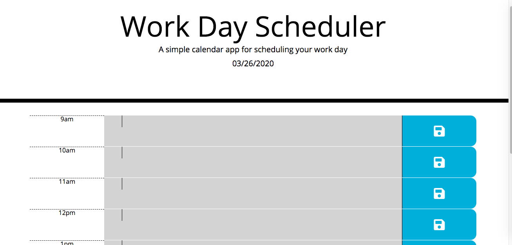

# workDay-scheduler

## Description of app
Created a simple calendar application that allows the user to save events for each hour of the day. This app runs in the browser and feature dynamically updated HTML and CSS powered by jQuery.


## Technology Used

1. Javascript
2. HTML5
3. CSS

## Acceptance Criteria

```
GIVEN I am using a daily planner to create a schedule
WHEN I open the planner
THEN the current day is displayed at the top of the calendar
WHEN I scroll down
THEN I am presented with timeblocks for standard business hours
WHEN I view the timeblocks for that day
THEN each timeblock is color coded to indicate whether it is in the past, present, or future
WHEN I click into a timeblock
THEN I can enter an event
WHEN I click the save button for that timeblock
THEN the text for that event is saved in local storage
WHEN I refresh the page
THEN the saved events persist
```

## Image of Working App



### Interesting bit of Code
```javascript
  function formatAMPM(hours) {
    var ampm = hours >= 12 ? 'pm' : 'am';
    hours = hours % 12;
    hours = hours ? hours : 12;
    return hours + ampm;
  }
```
Although the above is not my code. I "barrowed " this snippet of code from github user.
I really liked the way they used the modulo operator. It is a real clever way to display the time for the time 
schedule in the DOM. 

